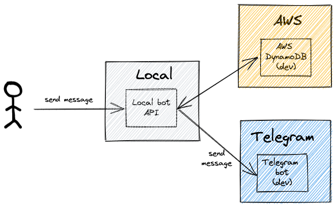
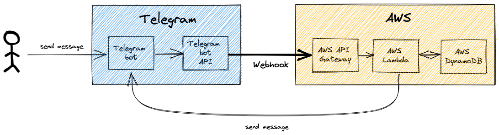

<div align="center">
  <h1 align="center">👨‍💻 Tech Setup</h1>
</div>

IsHawkerCentreClosed bot uses the following tech stack:

- Node.js with TypeScript
- Serverless framework
- Telegram bot API / webhooks
- AWS API Gateway / Lambda
- AWS DynamoDB

The setup is mirrored on 2 environments - 1 for dev and 1 for prod. The replication is done throughout the entire stack, from a "dev" Telegram bot to "dev" API Gateway endpoints and "dev" DynamoDB tables.

### Dev architecture



### Prod architecture



This guide details the setup process on both dev and prod environments, as well as running a local server instance. To setup on a single environment for personal testing purposes, simply ignore the prod environment segments.

# Infrastructure setup

## `.env` file

An `.env` file is used to define the environment variables used for the various services:

1. Telegram bots

1. AWS environment (region, API gateway keys)

1. DynamoDB table names

1. Discord

   - Only if Discord channels are to be used for debugging

1. Sentry

   - Only if Sentry is to be used for error monitoring

1. Server

   - Only for deployment of server APIs

Refer to [env.sample](./env.sample) for an example.

## Telegram bots

Create the 2 bots with the [BotFather](https://t.me/botfather) and note down the returned values of the bot tokens.

Update the bot tokens in `.env` accordingly.

# TL;DR version

## Setup dev & prod environments

```bash
# 1. Create and seed dev and prod DDB tables
yarn init:db

# 2. Deploy APIG endpoints and Lambda functions in dev and prod envs
yarn deploy:all

# 3. Update APIG_* values in .env

# 4. Initialise dev and prod bot webhooks
yarn init:bot:dev && yarn init:bot:prod
```

Your bots are now fully functional!

## Setup dev environment with local server

```bash
# 1. Create and seed dev DDB table
yarn init:db:dev

# 2. Initialise dev bot webhook
yarn init:bot:dev

# 3. Run local server
yarn dev
```

You can now send "messages" to the bot via `http://localhost:3000/dev/bot`. These "messages" replicate the payload that is sent from the Telegram bot API to the webhook, so in addition to the input message, it contains other metadata like user ID and timestamp.

# Breakdown

The overall setup consists of 3 steps:

1. Creation and seeding of DDB tables
2. Deployment of APIG endpoints and Lambda functions
3. Initialisation of bot webhook

## Creation and seeding of DDB tables

First, 5 DDB tables are created in the respective environments via `yarn run:db:{{env}}:create`:

1. CLOSURES
2. HC
3. USERS
4. FEEDBACK
5. INPUTS

The schema of each table is specified in their respective file under the `src/models` folder.

Then, `yarn run:db:{{env}}:seed` seeds the CLOSURES and HC tables with the latest values obtained from the data.gov.sg API.

## Deployment of APIG endpoints and Lambda functions

The deployment for these 2 services is managed by the Serverless framework.

6 Lambda functions will be deployed, along with 1 API Gateway endpoint:

1. `bot` (with APIG endpoint)
2. `notificationsTrigger`
3. `syncDbTrigger`
4. `healthinessCheckTrigger`
5. `scanNewEntriesTrigger`
6. `runBackupTrigger`

The functionality of each trigger is detailed in the
[README](./README.md).

`yarn deploy:{{env}}` installs a fresh deployment in the specified environment. Upon the first installation, note the APIG IDs and update the `APIG_*` value(s) in `.env`. Note that the APIG IDs will only change when there is a teardown and re-setup of the entire environment; re-deploying alone would not update the IDs.

### Updating an existing deployment

There are 2 methods to update an existing deployment, depending on the changes that have been made:

1. Infrastructure changes (e.g. editing `serverless.yml`)

   - Run `yarn deploy:{{env}}`
   - Re-deploys the entire environment

2. Code changes (only changes to `.ts` files)

   - Run `yarn deploy:{{env}} -f {{function_name}}`
     - If updating the `bot` function, a helper command `yarn deploy:{{env}}:bot` can be used instead
   - Uploads the updated code to Lambda
   - This is much faster than re-deploying the entire environment as this performs a hot swap of the Lambda code

## Initialising bot webhook

Finally, we set up the webhooks on our Telegram bots via `yarn init:bot:{{env}}` so that all messages sent to the bot will be immediately forwarded to our API gateway endpoint.

Verify that the output webhook URL corresponds correctly to your API gateway URL.

Your bots will now be good to go!

# Links

[Emoji Unicode Tables](https://apps.timwhitlock.info/emoji/tables/unicode)
